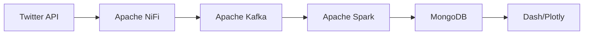

# Twitter-Sentiment-With-Nifi-Kafka
Real-time Twitter sentiment analyzer using AWS, Docker, and big data tools. Features automated data pipeline with Apache NiFi, Kafka, and Spark for extraction and processing, MongoDB for storage, and Dash/Plotly for interactive visualization.
# Twitter Sentiment Analysis Project 🐦

[](LICENSE)
[](https://www.docker.com/)
[](https://kafka.apache.org/)
[](https://spark.apache.org/)

## 📋 Table of Contents
- [Overview](#overview)
- [Architecture](#architecture)
- [Prerequisites](#prerequisites)
- [Installation](#installation)
- [Project Structure](#project-structure)
- [Usage](#usage)
- [Data Pipeline](#data-pipeline)
- [Contributing](#contributing)
- [License](#license)

## 🎯 Overview

A real-time streaming application for analyzing Twitter sentiments with visualization capabilities. This project implements a complete data pipeline from tweet extraction to sentiment visualization using various big data technologies.

## 🏗️ Architecture



### Tech Stack
| Technology | Version | Purpose |
|------------|---------|----------|
| Apache NiFi | 1.3.2 | Data Ingestion |
| Apache Kafka | 2.8.0 | Stream Processing |
| Apache Spark | 3.1.1 | Data Processing |
| MongoDB | 4.4.5 | Data Storage |
| Dash | 1.20.0 | Visualization |

## 💻 Prerequisites

```bash
# System Requirements
- AWS EC2 Instance (t2.xLarge)
- 32GB RAM
- Ubuntu 16.04
- Docker v3.0.0
```

## 🚀 Installation

1. Clone the repository:
```bash
git clone https://github.com/yourusername/twitter-sentiment-analysis.git
cd twitter-sentiment-analysis
```

2. Configure AWS EC2:
```bash
# For Windows Users
ssh -i "your-key.pem" ubuntu@your-ec2-public-ip

# For Mac/Linux Users
chmod 400 your-key.pem
ssh -i "your-key.pem" ubuntu@your-ec2-public-ip
```

3. Install Docker:
```bash
sudo apt-get update
sudo apt-get install docker.io
sudo apt-get install docker-compose
```

4. Start the services:
```bash
docker-compose up -d
```

## 📁 Project Structure

```
twitter-sentiment-analysis/
├── Configuration/
├── Container/
│   └── docker-compose.yml
├── Installation/
│   └── Presentation.ipynb
├── Project Execution/
│   ├── schemagenerator.ipynb
│   ├── sentimentanalyzer.ipynb
│   ├── streamlistener.ipynb
│   └── sentimentvisualizer.ipynb
├── .gitignore
├── LICENSE
└── README.md
```

## 📝 Usage

1. Configure Twitter Developer Account:
```python
# In streamlistener.ipynb
consumer_key = "YOUR_CONSUMER_KEY"
consumer_secret = "YOUR_CONSUMER_SECRET"
access_token = "YOUR_ACCESS_TOKEN"
access_token_secret = "YOUR_ACCESS_TOKEN_SECRET"
```

2. Start Data Pipeline:
```bash
# Start NiFi
docker-compose up nifi

# Start Kafka
docker-compose up kafka

# Start MongoDB
docker-compose up mongodb
```

3. Run Jupyter Notebooks in sequence:
```bash
jupyter lab
```

## 🔄 Data Pipeline

### 1. Data Extraction
```python
# Example NiFi processor configuration
{
    "processor": "GetTwitter",
    "properties": {
        "Twitter Endpoint": "Filter Endpoint",
        "Language": "en"
    }
}
```

### 2. Data Transformation
```python
# Example Spark transformation
from pyspark.sql.functions import *

df = spark.readStream \
    .format("kafka") \
    .option("kafka.bootstrap.servers", "localhost:9092") \
    .option("subscribe", "twitter_topic") \
    .load()
```

### 3. Sentiment Analysis
```python
# Example sentiment analysis pipeline
from pyspark.ml import Pipeline
from pyspark.ml.feature import HashingTF, IDF, Tokenizer

pipeline = Pipeline(stages=[
    Tokenizer(inputCol="text", outputCol="words"),
    HashingTF(inputCol="words", outputCol="rawFeatures"),
    IDF(inputCol="rawFeatures", outputCol="features")
])
```

## 👥 Contributing

1. Fork the repository
2. Create your feature branch:
```bash
git checkout -b feature/YourFeature
```

3. Commit your changes:
```bash
git commit -m 'Add some feature'
```

4. Push to the branch:
```bash
git push origin feature/YourFeature
```

5. Open a Pull Request

## 📄 License

This project is licensed under the MIT License - see the [LICENSE](LICENSE) file for details.

---

<div align="center">
Made with ❤️ by [Your Name]
</div>
